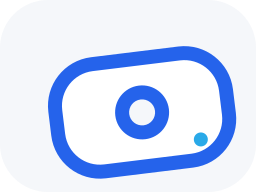
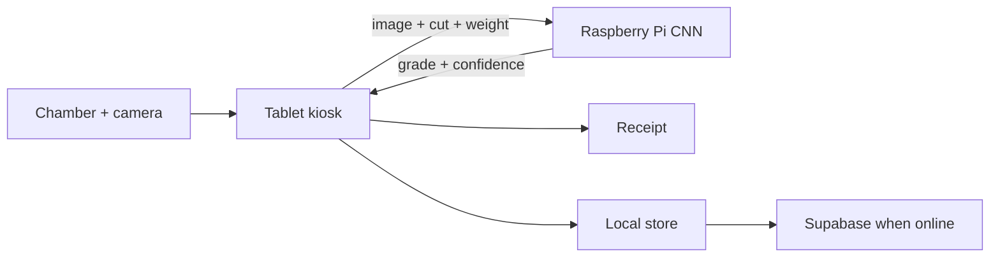

<p align="center">
  
</p>

<h1 align="center">TunaEye. Sea Beyond the Cut.</h1>

<p align="center">
  <strong>We don't replace the expert eye. We extend its reach.</strong>
</p>

<p align="center">
  Built on expert knowledge. Enhanced by computer vision.<br />
  Designed to extend the reach of human expertise.
</p>

<p align="center">
  
  
  
  
</p>

---

TunaEye is a **CNN-based computer vision** kiosk for yellowfin tuna. It supports expert graders by classifying **sashibo core** and **tail-cut** images — it does not take the grader's place.

Expert-annotated data, standardized capture, and transfer learning make grading more consistent, faster, and easier to share. The human remains the authority.

```text
  expert traits  ──mirrors──►  CNN assist  ──supports──►  grader decision
       ▲                              ▲
  annotated cuts              sashibo + tail cut
```

<table>
  <tr>
    <td width="33%" valign="top">
      <h3>Expert, not replaced</h3>
      Mirrors the traits graders already use. Final call stays with a qualified person.
    </td>
    <td width="33%" valign="top">
      <h3>Standard capture</h3>
      Guided tablet flow, lighting chamber, weight, and one evidence record per sample.
    </td>
    <td width="33%" valign="top">
      <h3>CNN on the edge</h3>
      Raspberry Pi inference on the station LAN. Review, override, print, then sync.
    </td>
  </tr>
</table>

---

## What you get

| Surface | Role |
| --- | --- |
| **Public landing** | Brand, install, station story |
| **Kiosk PWA** | Capture → infer → review → receipt |
| **Admin** | Records, prices, graders, devices, audit |
| **Pi edge** | Grade + confidence over LAN |
| **Cloud** | Supabase records + evidence when configured |



---

## Run

```powershell
npm install
npm run dev
```

Open **http://localhost:3000**

| Command | Result |
| --- | --- |
| `npm run build` then `npm run preview` | Production build |
| `npx vercel` | HTTPS deploy (`dist` + SPA fallback) |

Camera and PWA install need **HTTPS** or **localhost**.

---

## Grade a fish

```text
1  Expert grader          5  Align + capture
2  Name                   6  Pi inference
3  Sashibo / tail / both  7  Review or override
4  Weight (max 200 kg)    8  Print receipt
```

Same-fish vs different-fish is asked when both cuts are selected. After **two sessions in 30 minutes**, that grader skips the placement tutorial. **Grade another** keeps the grader and returns to sample select.

---

## Station notes

<p>

</p>

- **Install** — landing QR, or browser **Install app / Add to Home Screen**
- **Cameras** — lists every device camera; allow permission, then reload if blocked
- **Admin PIN** — `1234` (change before production)
- **Overrides** — PIN-gated; original model confidence is kept
- **Print** — 80 mm receipt layout via the OS print dialog
- **Offline** — JPEG evidence in IndexedDB; metadata local until sync

<br clear="all" />

---

## Repo map

| Path | What it is |
| --- | --- |
| `src/MarketingLanding.tsx` | Public site |
| `src/App.tsx` | Kiosk workflow |
| `src/kioskState.ts` | Session reducer |
| `public/` | PWA, icons, samples, install QR |
| `ARCHITECTURE.md` | Pi / cloud contracts |
| `FEATURES.md` | Feature inventory |

Without Pi or cloud credentials, records stay on the device with a retryable sync state. Phone clients must use the same Supabase project as `docs/SHARED_SUPABASE_CONTRACT.md`.
